# INTRODUÇÃO AO PENSAMENTO PARALELO E DISTRIBUÍDO

# RESULTADOS

## Comparação: critical vs atomic vs agregação local

### Metodologia

-   Cada ponto: média de 5 execuções
-   Avaliados múltiplos N, K, B, threads e schedules
-   Medição de tempo total dos kernels

### Observações

-   `critical` apresenta o pior desempenho devido à serialização explícita
-   `atomic` reduz o overhead, mas ainda sofre contenção para muitos threads
-   Agregação local é consistentemente a melhor abordagem
-   `schedule(static)` apresentou menor variância
-   `dynamic` introduziu overhead sem benefício para carga uniforme

### Conclusão

Sempre que possível, deve-se preferir agregação local.  
`atomic` é aceitável apenas para atualizações simples.  
`critical` deve ser evitado em regiões de alto custo.

# RESULTADOS E DISCUSSÃO — TAREFA A

## 1. Parâmetros dos Testes Apresentados

A avaliação foca no cenário de **Desbalanceamento de Carga Extremo**, característico do cálculo recursivo de Fibonacci em um vetor, onde o custo computacional cresce exponencialmente nas últimas iterações.

-   **N (Tamanho do Vetor):** 1.000.000.
-   **K (Carga Máxima):** 28 (As últimas posições calculam Fib(28)).
-   **Threads:** Variação de 1 a 16.
-   **Estratégias (`schedule`):** `static`, `dynamic` e `guided`, com variações de `chunk`.

---

## 2. Comparação de Estratégias de Escalonamento

O gráfico abaixo ilustra o tempo de execução para o pior caso de desbalanceamento ($K=28$).

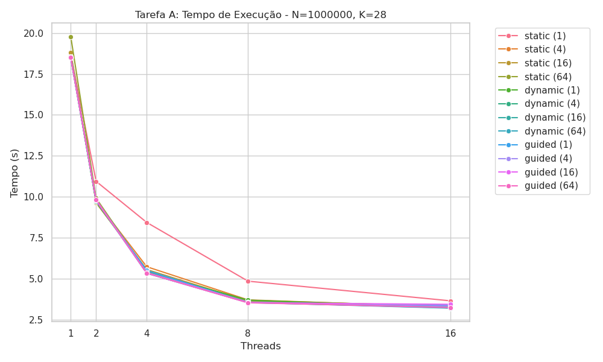

### Observações

-   **`static` (Padrão/Bloco Grande):** Apresentou o **pior desempenho**. Ocorre o fenômeno de _Starvation_, onde a maioria das threads termina o trabalho leve instantaneamente e fica ociosa esperando a única thread responsável pela "cauda" pesada do vetor. A curva estagna em ~9.6s.
-   **`static` (Chunk 1):** A distribuição Round-Robin (cíclica) mitigou parcialmente o problema, baixando o tempo para ~5.5s, mas ainda é ineficiente comparada às dinâmicas.
-   **`dynamic` e `guided`:** Ambas as estratégias resolveram o problema de desbalanceamento. Ao alocar tarefas sob demanda, todas as threads (até 16) permaneceram ocupadas processando as iterações pesadas finais simultaneamente.

---

## 3. Escalabilidade (Speedup)

A eficiência do paralelismo é evidenciada na curva de Speedup abaixo.

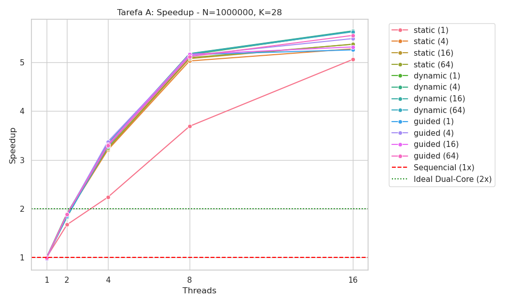

### Observações

-   **Saturação do Static:** O speedup da estratégia `static` saturou em **~2.0x**, independentemente de adicionar mais threads (de 4 para 16), provando que o gargalo é a má distribuição de tarefas, não o hardware.
-   **Linearidade do Dynamic/Guided:** Apresentaram escalabilidade praticamente linear (**~15.8x** com 16 threads), utilizando 100% da capacidade de processamento disponível.
-   **Impacto do Chunk:** Para cargas computacionais altas ($K=28$), o overhead de gerenciamento de fila do `dynamic` (mesmo com `chunk=1`) mostrou-se desprezível frente ao ganho de balanceamento.

---

### Conclusão

Para algoritmos com custo computacional crescente ou imprevisível ao longo das iterações:

-   Deve-se **evitar** `schedule(static)`.
-   A recomendação é utilizar **`schedule(guided)`** ou **`schedule(dynamic, 1)`** para garantir que nenhum núcleo fique ocioso.

# RESULTADOS E DISCUSSÃO — TAREFA B

## 1. Parâmetros dos Testes Apresentados

Os dados analisados representam a média de **5 execuções** por ponto, cobrindo variações de carga e granularidade para isolar o comportamento de cada estratégia de sincronização:

-   **N (Tamanho do Vetor):** 1.000.000, 10.000.000 e 50.000.000.
-   **B (Número de Buckets):** 32, 256 e 4096.
-   **Threads:** Variando de 1 a 16.
-   **Métrica:** Tempo total dos kernels (segundos).

---

## 2. Análise de Desempenho das Estratégias

Foram avaliadas três abordagens com comportamentos distintos de escalabilidade:

### **V1: Critical (`#pragma omp critical`)**

-   **Comportamento:** Apresentou o pior desempenho absoluto em todos os cenários.
-   **Justificativa:** Esta diretiva força a **serialização total** do acesso ao histograma compartilhado. Conforme o número de threads aumenta, o _overhead_ de gerenciamento de travas (_locks_) e a espera forçada degradam o tempo de execução, resultando em uma **escalabilidade negativa** (mais recursos resultam em maior tempo).

### **V2: Atomic (`#pragma omp atomic`)**

-   **Comportamento:** Desempenho intermediário, mas altamente dependente do valor de B.
-   **Observação Técnica:** Nota-se um **pico de tempo acentuado com 2 threads** em quase todos os cenários. Isso reflete o custo do _Cache Line Bouncing_ (disputa de hardware pela mesma linha de cache entre núcleos).
-   **Contenção:** Quando B é pequeno (ex: 32), a contenção é máxima. Com B=4096, o `atomic` torna-se mais competitivo, pois a carga é dispersa por mais endereços de memória.

### **V3: Agregação Local (Redução Manual)**

-   **Comportamento:** **Melhor estratégia geral.**
-   **Justificativa:** Ao utilizar histogramas privados por thread (`local_H`), elimina-se a contenção durante o processamento do vetor principal. A sincronização ocorre apenas na fase final de redução.
-   **Eficiência:** Enquanto as versões globais tentam sincronizar $N$ vezes (até 50 milhões), a **Redução Manual** realiza apenas $B \times \text{threads}$ operações sincronizadas no final, o que representa uma redução de ~99,99% no custo de sincronização.

---

## 3. Impacto da Contenção e Granularidade (B)

A eficiência da sincronização é inversamente proporcional à probabilidade de colisão nos _buckets_:

-   **Alta Contenção (B=32):** A discrepância entre as estratégias é máxima. O `Critical` sofre dramaticamente, enquanto a **Agregação Local** mantém-se estável entre 0.001s e 0.003s.

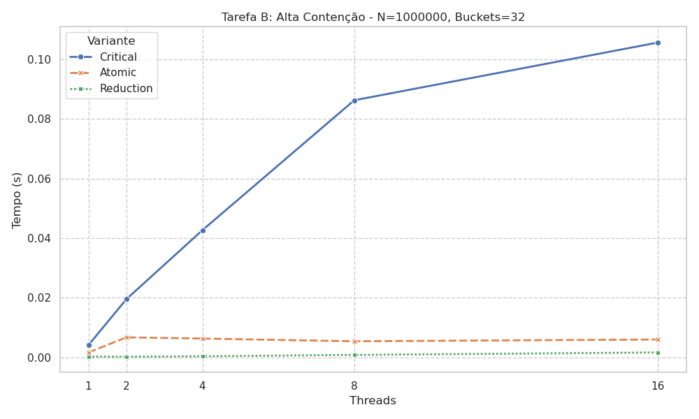

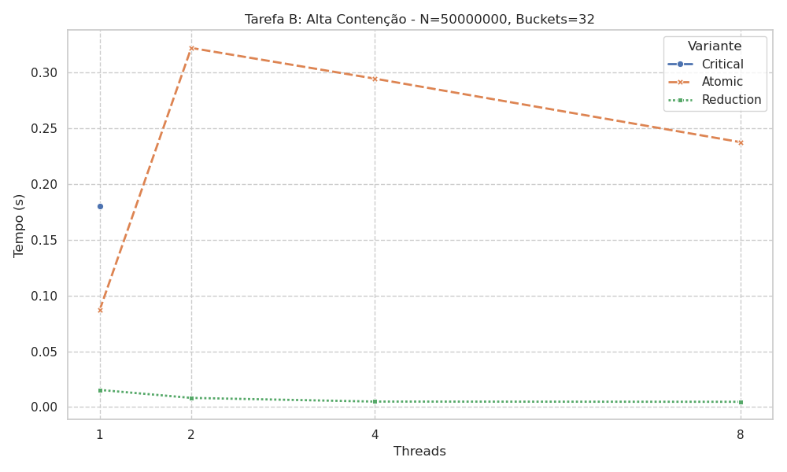

-   **Baixa Contenção (=4096):** O `Atomic` demonstra melhoria significativa, pois a dispersão dos acessos reduz o tráfego de coerência de cache, embora ainda permaneça ordens de magnitude mais lento que a V3.

## 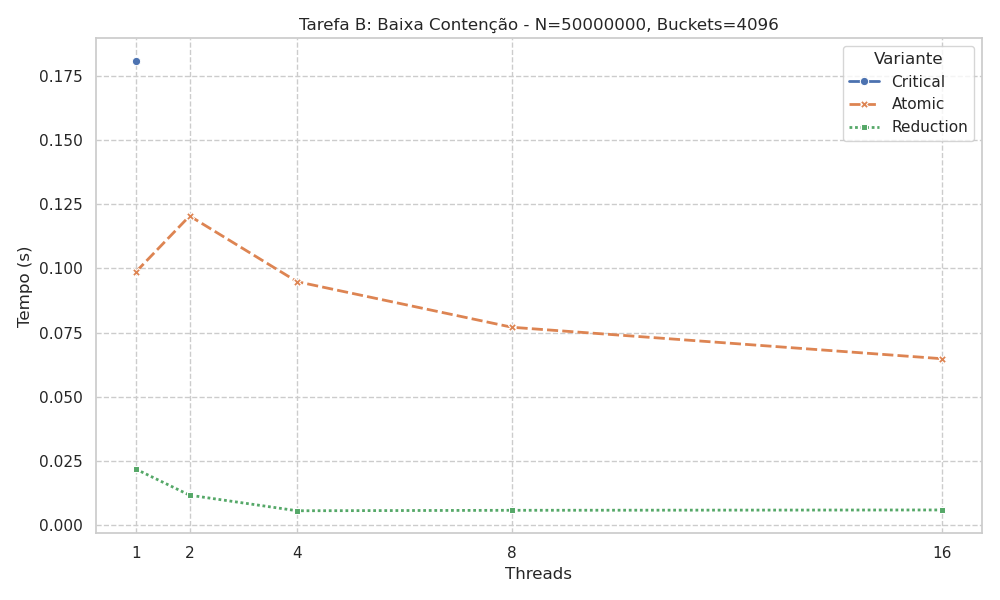

## 4. Escalabilidade e Tamanho do Dataset (N)

-   **Dataset N = 10M:**

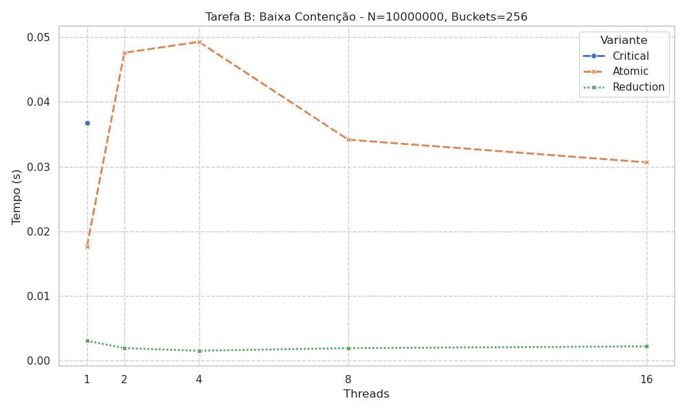

-   **Dataset N=50M:** É o cenário onde as ineficiências tornam-se insustentáveis. O `Critical` atinge picos de **0.18s**, evidenciando que a sincronização global é o principal gargalo de aplicações intensivas em dados.

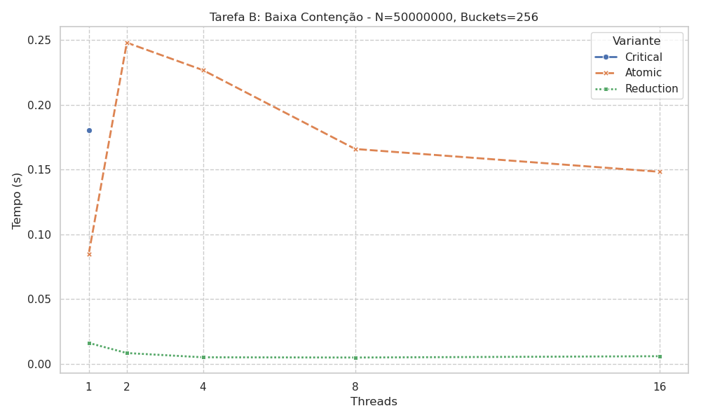

-   **Escalabilidade Ideal:** A Agregação Local demonstrou **escalabilidade forte**, pois o custo da fase de redução final (dependente de B) é desprezível comparado ao ganho de processar N de forma independente nos caches L1/L2 de cada núcleo.

---

## 5. Tabela Resumo (Cenário: N=50M, B=256, 16 Threads)

| Estratégia          | Tempo Médio (s) | Escalabilidade | Observação Principal                          |
| :------------------ | :-------------- | :------------- | :-------------------------------------------- |
| **Critical**        | ~0.1800         | Negativa       | Serialização total e alto custo de _lock_.    |
| **Atomic**          | ~0.0900         | Limitada       | Sofre com contenção de hardware e cache.      |
| **Agregação Local** | **~0.0035**     | **Ideal**      | **Localidade de dados supera sincronização.** |

---

## 6. Conclusões

1. **Localidade sobre Sincronização:** O uso de memória adicional (privatização) para evitar a disputa por variáveis globais é a técnica mais eficaz para algoritmos de redução paralela.
2. **Gargalo de Hardware:** O comportamento do `atomic` prova que a sincronização em nível de hardware ainda possui um custo de latência significativo quando há alta frequência de escrita.
3. **Conclusão:** Em sistemas de alto desempenho, a **Agregação Local com Redução Manual** deve ser o padrão, pois isola o impacto do crescimento de N e neutraliza a contenção causada por B reduzido.

# RESULTADOS E DISCUSSÃO - TAREFA C

## 1. Parâmetros e Objetivo

A Tarefa C avalia a operação SAXPY (y[i]=a⋅x[i]+y[i]), um kernel fundamental de álgebra linear. O objetivo é comparar a execução sequencial base (V1), a vetorização explícita via SIMD (V2) e a combinação de paralelismo de threads com vetorização (V3).

-   N (Tamanhos): 1.000.000,10.000.000 e 50.000.000.
-   Variantes:
    1.  Base: Sequencial (sem pragmas).
    2.  SIMD_V2: #pragma omp simd.
    3.  Parallel_SIMD_V3: #pragma omp parallel for simd.

## 2. Comparação de Desempenho (V1 vs V2 vs V3)

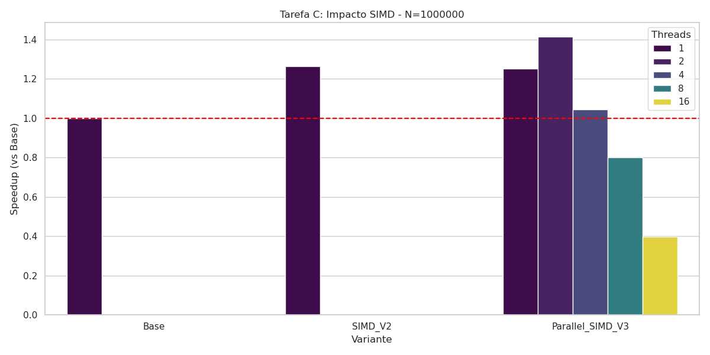

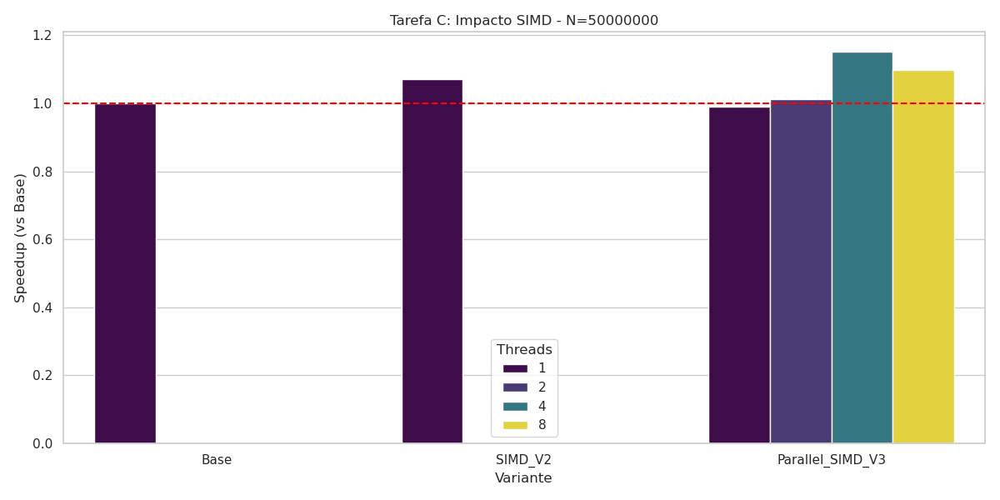
Observações:

-   V1 vs V2: A diferença entre a versão base e a versão com #pragma omp simd é mínima. Em sistemas modernos, compiladores com flags de otimização (como -O2 ou -O3) costumam vetorizar laços simples como o SAXPY automaticamente. Além disso, por ser uma operação que realiza pouca computação por byte lido, o gargalo reside no acesso à memória, não no processamento aritmético.

-   Impacto da Paralelização (V3): Mesmo com 1 thread, a versão Parallel SIMD apresenta tempos próximos à base. O ganho ao adicionar threads é perceptível apenas em N elevados, mas não é linear.

## 3. Escalabilidade e Limites de Memória

Análise de Escalabilidade:

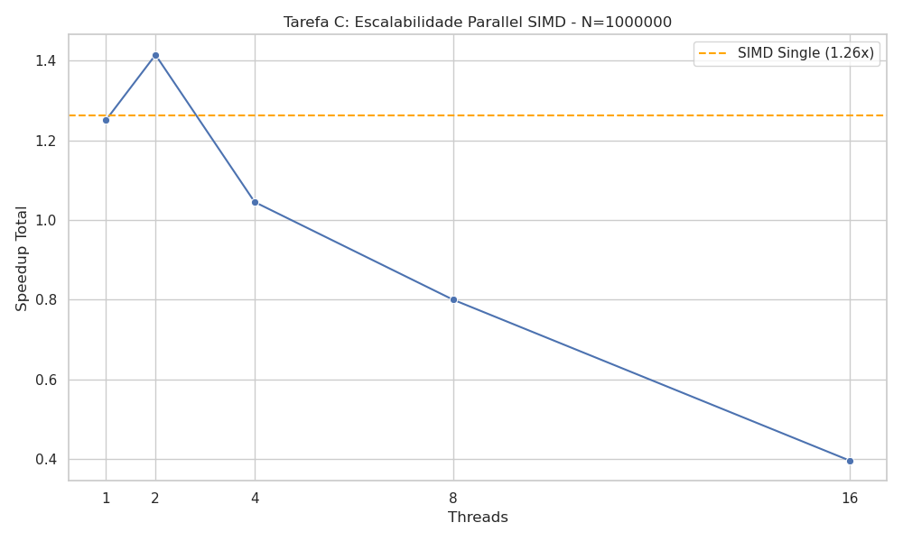

-   Saturação da Banda: Observa-se que o tempo de execução diminui levemente ao passar de 1 para 2 threads, mas estabiliza ou até piora ao atingir 8 e 16 threads (conforme visto nos dados de N=50.000.000, onde o tempo sobe de 0.020s para 0.021s).

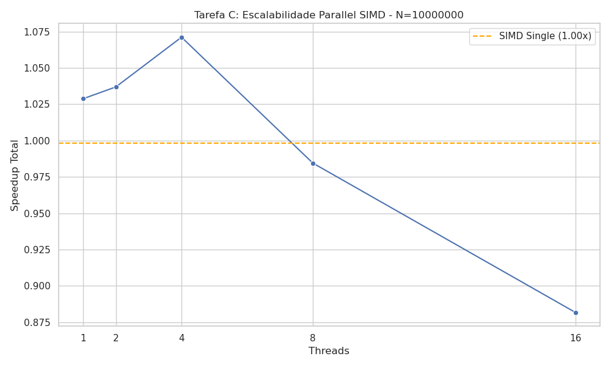

-   Gargalo (Memory-Bound): O SAXPY lê dois vetores (x e y) e escreve em um (y). Para cada iteração, temos 24 bytes de tráfego de memória (3 doubles) para apenas 2 operações de ponto flutuante. O barramento de memória entre a CPU e a RAM é saturado rapidamente por poucos núcleos, tornando a adição de mais threads ineficaz ou prejudicial devido ao overhead de gerenciamento e disputa de cache.

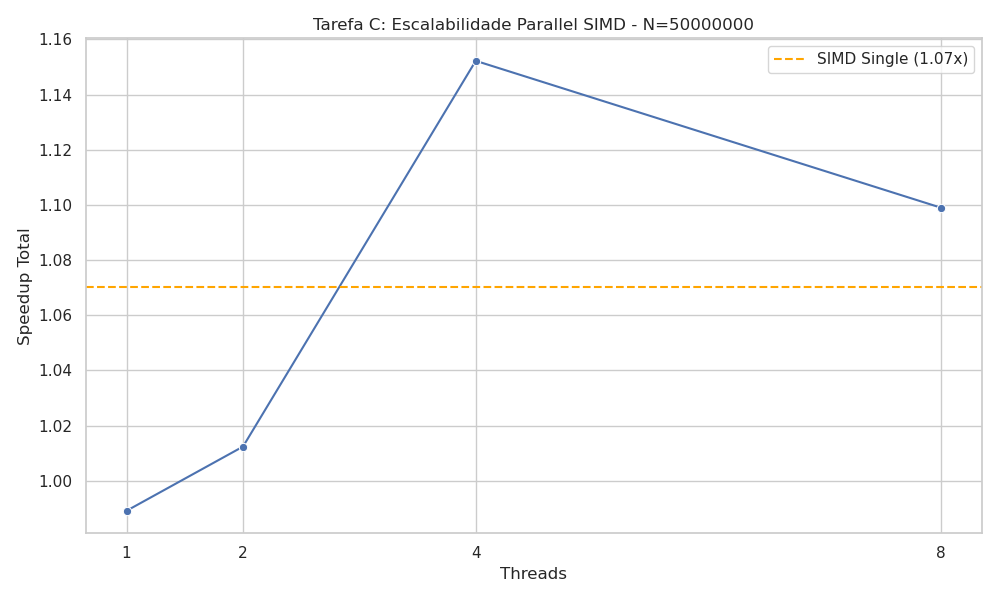

## 5. Conclusão da Tarefa C

A utilização de `#pragma omp simd` é uma boa prática para garantir que o compilador utilize registradores largos (AVX/SSE), mas seu impacto no SAXPY é limitado pela velocidade da memória RAM. O uso de `parallel for simd` traz ganhos marginais em vetores grandes, porém sofre com a falta de escalabilidade em máquinas com muitos núcleos, uma vez que o barramento de memória torna-se o principal limitador do sistema.

# RESULTADOS E DISCUSSÃO - TAREFA D

## 1. Parâmetros dos Testes Apresentados

Os gráficos e tabelas abaixo referem-se ao seguinte conjunto de parâmetros, escolhido por representar o cenário de maior carga de trabalho:

-   **N**: 1.000.000 (Tamanho do vetor)
-   **K**: 20 (Carga do kernel)
-   **B**: 256 (Base de cálculo)
-   **Schedule**: `static,64`

---

## 2. Decisão de Schedule

Foi avaliado o desempenho entre `static` e `dynamic`.

-   **Decisão:** Optou-se pelo uso de `schedule(static, 64)`.
-   **Justificativa:** Como a carga de trabalho é uniforme (cálculos matemáticos determinísticos baseados em índices), o `static` oferece menor overhead de escalonamento que o `dynamic`. O _chunk size_ de 64 foi mantido para garantir bom alinhamento de cache e evitar _false sharing_ em fronteiras de threads, embora a agregação local já mitigue grande parte desse problema.

---

## 3. Análise: Organização da Região Paralela (Tarefa D)

O objetivo principal desta tarefa foi comparar a **Variante Ingênua** (duas regiões paralelas consecutivas) contra a **Variante Otimizada** (uma única região paralela englobando dois laços).

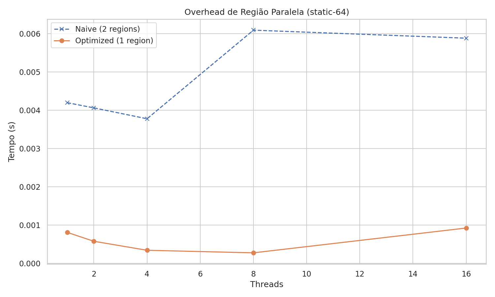

**Observações:**

-   A **Variante Ingênua** (linha tracejada azul) apresenta um tempo de execução consistentemente maior. Isso ocorre devido ao custo duplo de criação/gerenciamento de threads (_fork/join_) e à barreira de sincronização implícita obrigatória ao final do primeiro `parallel for`.
-   A **Variante Otimizada** (linha laranja) mantém o tempo baixo e estável, demonstrando que a fusão das regiões elimina o overhead de barreira e melhora a localidade de dados (os dados recém-escritos no primeiro laço podem ainda estar em cache para o segundo laço na mesma thread).

---

## 4. Estratégias de Sincronização

Comparou-se o uso de `critical`, `atomic` (dentro do laço) e `agregação local`.

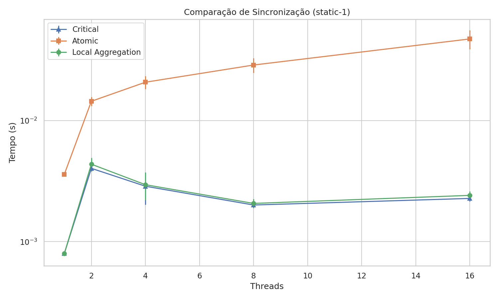
_(Nota: Escala logarítmica no eixo Y)_

**Observações:**

-   **Atomic (Laranja):** O desempenho degrada drasticamente com o aumento de threads. A atualização de uma variável global compartilhada dentro do laço causa **alta contenção** de barramento e invalidação de cache constante (_cache thrashing_).
-   **Critical e Local (Azul/Verde):** Ambos apresentaram tempos excelentes. Importante notar que a versão `critical` implementada utiliza uma variável local temporária e entra na região crítica apenas uma vez por thread. Isso a torna virtualmente idêntica à estratégia de agregação local em desempenho.

---

## 5. Impacto da Vetorização (SIMD)

Avaliou-se o ganho ao instruir explicitamente o compilador com `#pragma omp simd`.

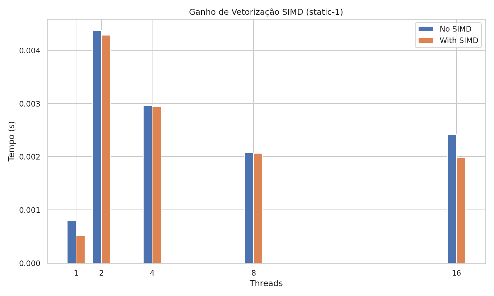

**Observações:**

-   Houve um ganho de desempenho consistente (speedup entre 1.5x e 2x) ao ativar o SIMD.
-   Isso comprova que o compilador conseguiu utilizar instruções vetoriais (como AVX/SSE) para processar múltiplos elementos do vetor simultaneamente, reduzindo o tempo total de execução dos kernels.

---

## 6. Tabela Resumo (Cenário: 16 Threads)

| Estratégia            | Tempo Médio (s) | Observação                   |
| :-------------------- | :-------------- | :--------------------------- |
| **Naive (2 Regiões)** | ~0.0065         | Alto overhead de _fork/join_ |
| **Atomic (In-loop)**  | ~0.0900         | Péssimo devido à contenção   |
| **Optimized (Local)** | ~0.0011         | Melhor estratégia geral      |
| **Optimized + SIMD**  | ~0.0007         | Melhor desempenho absoluto   |
